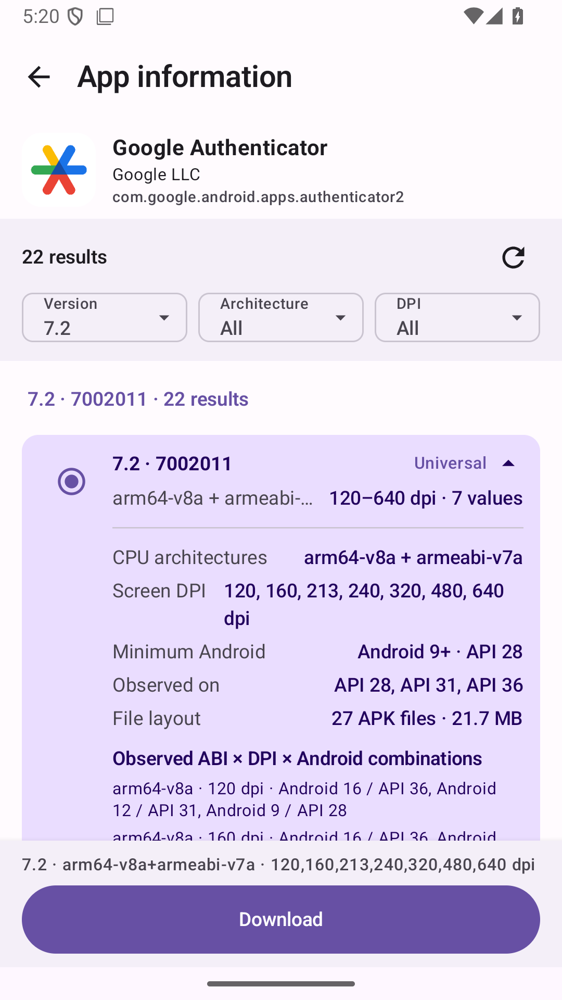

# Aurora Pure

[](https://github.com/sampple-korea/AuroraPure/actions/workflows/android.yml)
[](https://github.com/sampple-korea/AuroraPure/releases/latest)
[](LICENSE)

**English** · [한국어](README.ko.md) · [简体中文](README.zh-CN.md) · [日本語](README.ja.md)

Aurora Pure is a download-only Android app and desktop CLI for saving APK files delivered by Google Play. It keeps the useful search, artwork, developer, and description views from Aurora Store while removing installation, installed-app management, and automatic updates.

> Aurora Pure is an independent GPL fork. It is not an official Google or Aurora OSS distribution and is not affiliated with either project.

## Current interface

<p align="center">
  
  
  
</p>
<p align="center">
  
  
</p>

The Android screenshots and CLI capture above are generated from the 1.3.0 release candidate. The interface is fully available in English, Simplified Chinese, Japanese, and Korean.

## Download

Get release files from [GitHub Releases](https://github.com/sampple-korea/AuroraPure/releases/latest).

| Platform | Release file | Requirement |
| --- | --- | --- |
| Android | `AuroraPure-1.3.0.apk` | Android 10 / API 29 or newer |
| Linux and macOS CLI | `aurora-pure-cli-1.3.0.tar` or `.zip` | Java 21 or newer |
| Windows CLI | `aurora-pure-cli-1.3.0.zip` | Java 21 or newer; run `bin\aurora-pure.bat` |

Aurora Pure downloads files only. To install a downloaded app, use Android's file manager or a compatible split-APK installer separately.

## What 1.3.0 can do

- Search by app name, package name, Google Play URL, or a shared Play link.
- Show the app icon, developer, package name, version metadata, and description.
- Use an anonymous session without entering a personal Google account.
- Automatically discover the complete supported delivery matrix when an app is opened, without ABI or DPI preselection.
- Open on the newest numeric version by default, with always-visible Version, Architecture, and DPI filter tiles built only from returned results.
- Keep each row compact—version, architecture, and DPI—then reveal minimum Android, tested profiles, APK count, size, and exact combinations on tap.
- Keep the selected result and Download action fixed at the bottom while the result list scrolls.
- Offer a **Universal** result that includes every latest architecture set Play actually returned after probing ARM64, ARM32, x86_64, and x86.
- Probe the standard density buckets—120, 160, 213, 240, 320, 480, and 640dpi—and follow each path through observed Android delivery tiers.
- Query up to four independent delivery paths concurrently and show the active ABI/DPI/Android work in the Android loading view.
- Read the delivered base APK's split declaration and request **every advertised language APK by default**.
- Download up to four unique APKs in parallel, safely resume byte ranges, and avoid transferring identical content twice.
- Verify Play-provided hashes, APK signatures, signer consistency, package names, versions, split identities, and the final saved file.
- Save a single file as `.apk` and a split result as an APK-only `.apks` archive.
- Provide the same search, discovery, selection, download, verification, history, and configuration workflow in an interactive PC CLI.

## Actual variant discovery

Opening an app on Android automatically starts a complete scan: ARM64, ARM32, x86_64, and x86 across all seven standard DPI buckets. Each `ABI × DPI` path begins at Android API 36, reads the `minSdk` from the APK Play actually returned, and then probes the next meaningful older Android tier. Independent paths run with bounded concurrency while traversal inside each path remains ordered.

Results are split into version sections ordered by numeric `versionCode`, newest first. The display-oriented `versionName` is never compared as a string. The newest version is selected as the initial view; choosing **All** exposes every version section with older sections collapsed. Architecture and DPI filters contain only values present in the scan.

Within each version, responses are grouped only when their version and real APK artifact set are identical. A collapsed row shows only the delivered version, compatible architectures, and observed DPI values. Tapping it reveals:

- minimum Android version from the APK manifest;
- Android API profiles that returned that exact set;
- unique APK count and download size.

The **Universal** row combines the latest discovered sets without mixing version codes. All four ABI families are probed; a family that Play does not deliver for that app is omitted rather than fabricated, and the row shows exactly which families were returned. Nothing is selected until the user chooses a result. Aurora Pure does not rewrite or merge several split APKs into a fabricated monolithic APK.

Google Play may target other dimensions, such as device features or graphics texture formats. Version 1.3.0 covers the ABI, density, Android-version, and language dimensions it explicitly probes—not every possible Play targeting dimension.

## Output contract

| Delivered result | Saved file | Contents |
| --- | --- | --- |
| One standalone APK | `.apk` | The APK bytes delivered by Google Play, unchanged |
| Multiple APKs | `.apks` | Root-level `.apk` entries only; no JSON, checksum text, icon, or modified APK |

Output names use the package name, version code, and useful ABI/DPI identity. They do **not** add an `_all-languages` suffix: all advertised language packs are already the normal default.

Aurora Pure's `.apks` is a ZIP-compatible APK collection following the simple APK-only convention supported by tools such as SAI. It is not claimed to be a `bundletool build-apks` archive and does not contain an AAB-derived `toc.pb`. Universal and Combined archives can contain alternative base/configuration sets; an installer must choose one compatible set.

Runtime-downloaded Play Asset Delivery content, account data, and a game's complete post-install resources are outside this APK-only scope. When Google Play reports additional non-APK data, Aurora Pure displays that limitation.

## Desktop CLI

Running the CLI without a subcommand starts a guided workflow with numbered search and actual-variant selection:

```bash
bin/aurora-pure
```

Every feature is also scriptable:

```bash
# Search and inspect public metadata
bin/aurora-pure search "Google Authenticator"
bin/aurora-pure info com.google.android.apps.authenticator2

# Display every combination returned for all ABIs and standard DPI buckets
bin/aurora-pure variants com.google.android.apps.authenticator2

# Resolve every declared language split and download the Universal latest set
bin/aurora-pure download com.google.android.apps.authenticator2 \
  --variant universal --yes

# Re-open and cryptographically verify an existing result
bin/aurora-pure verify ~/Downloads/AuroraPure/example.apks

# Machine-readable output is available for automation
bin/aurora-pure variants com.example.app --json
bin/aurora-pure history --json
```

Complete discovery is the CLI default too. Scripts may deliberately narrow a scan with `--architecture` (`universal`, `both`, `64`, `32`, `arm64`, `arm32`, `x86_64`, or `x86`), `--density` (`current`, `all`, a standard name, or an exact DPI), and `--android-api`. `config` stores only language, download parallelism, and output location; `history` never stores tokens, cookies, or signed delivery URLs.

## Deliberately absent

- direct install or system installer launch;
- root, Shizuku, or unattended installation;
- installed-app inventory and update lists;
- automatic, scheduled, boot-time, or background downloads;
- personal Google account login or account management;
- recommendation feeds, rankings, review submission, analytics, or advertising;
- arbitrary URL and APK-mirror downloads.

On Android, leaving the entire app pauses active network transfers. Returning to the app and choosing **Resume** continues only after range-safety checks. The CLI keeps safe `.part` files when interrupted and validates the server's `Content-Range` before appending.

## Permissions and privacy

The only Android platform permissions requested by the final app are:

- `android.permission.INTERNET`
- `android.permission.ACCESS_NETWORK_STATE`

It does not request package installation, all-app visibility, all-files access, notifications, or foreground-service permissions. AndroidX also contributes an app-ID-scoped `signature` permission used to guard non-exported compatibility broadcasts; it grants no Android platform capability and only same-signer apps can hold it. Aurora Pure has no first-party ads, behavior analytics, or automatic crash upload. See [PRIVACY.md](PRIVACY.md) for the exact network and local-data boundary.

## Build and verify

JDK 21 and Android SDK 36 are required. The repository includes its Gradle Wrapper.

```bash
./gradlew --no-daemon --no-configuration-cache \
  :pure:testDebugUnitTest :pure:lintDebug :pure:assembleRelease \
  :cli:test :cli:distZip :cli:distTar
```

Release integration tests can use a local, non-committed directory of real Play APKs to exercise APK-only `.apks` export and cryptographic re-verification. Full details are in [BUILDING.md](BUILDING.md).

## Source and license

Aurora Pure is derived from [Aurora Store 4.8.3](https://gitlab.com/AuroraOSS/AuroraStore/-/tree/4.8.3), upstream commit `e9be2c8293e02cc362d603df6b12b019fdb849f2`. Source and modifications are distributed under GNU GPL v3 or later.

- [Release notes](RELEASE_NOTES.md)
- [Privacy notice](PRIVACY.md)
- [Upstream and trademark notice](NOTICE.md)
- [Build and signing guide](BUILDING.md)
- [GNU GPL v3 license](LICENSE)

Google Play's unofficial API and the external anonymous credential service can change or become temporarily unavailable. “Latest” always means the version currently observed across the anonymous delivery profiles Aurora Pure can query—not a promise of the globally highest version number.
