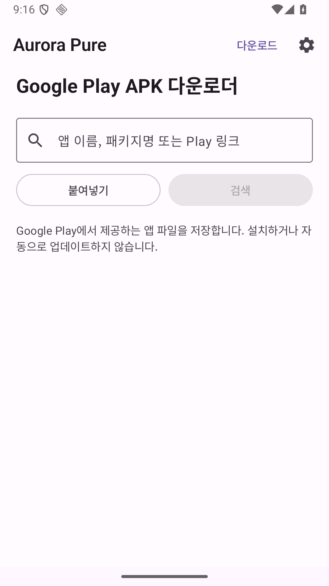
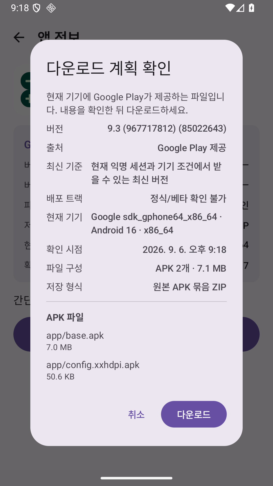
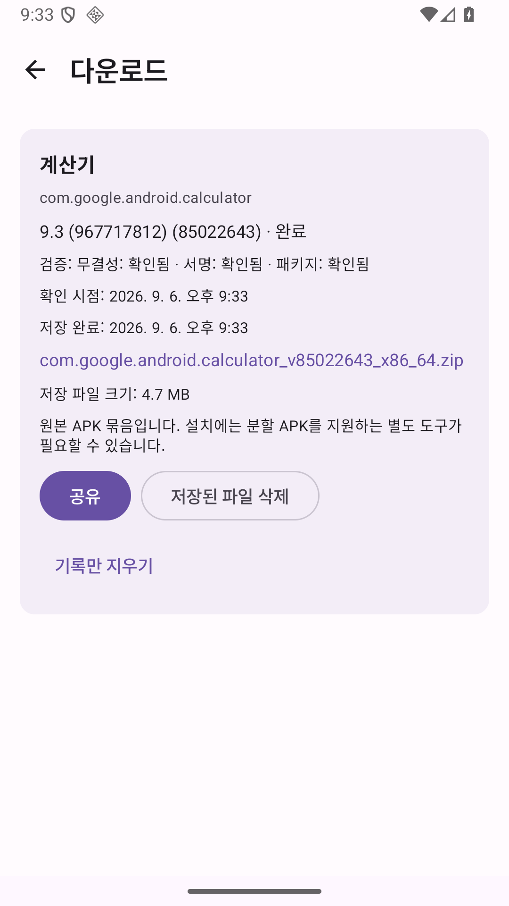

# Aurora Pure

[](https://github.com/sampple-korea/AuroraPure/actions/workflows/android.yml)
[](https://github.com/sampple-korea/AuroraPure/releases/latest)
[](LICENSE)

Google Play가 **현재 익명 세션과 현재 기기 조건에 제공하는 최신 원본 APK**를 저장하는 다운로드 전용 Android 앱입니다. Aurora Store 4.8.3을 기반으로 필요한 Google Play 연동만 남기고 설치·업데이트 관리 기능은 제거했습니다.

> Aurora Pure는 Google 또는 Aurora OSS의 공식 앱이 아닌 독립적인 GPL 포크입니다.

## 화면

<p align="center">
  
  
  
</p>

위 이미지는 현재 릴리스 APK를 Android 16에서 직접 실행해 캡처한 화면입니다.

## 다운로드

[GitHub Releases](https://github.com/sampple-korea/AuroraPure/releases/latest)에서 `AuroraPure-1.0.0.apk`와 `SHA256SUMS.txt`를 받으세요. Android 10(API 29) 이상을 지원합니다.

Aurora Pure는 APK를 **다운로드만** 합니다. 내려받은 앱을 설치하려면 Android 파일 관리자 또는 분할 APK를 지원하는 별도 도구를 사용해야 합니다.

## 핵심 기능

- 앱 이름, 패키지명, Google Play 링크 검색
- 앱 아이콘, 개발자, 설명과 제공 버전 표시
- 개인 Google 계정 입력 없는 익명 세션
- 다운로드 직전 제공 버전과 APK 파일 구성을 다시 조회
- 단일 APK와 기기별 분할 APK, 확인 가능한 공유 라이브러리 APK 보존
- 다운로드 일시정지·안전한 HTTP Range 이어받기·취소·재시도
- APK 해시, 서명, 패키지명, 버전, 분할 구성 검증
- `Download/AuroraPure` 또는 사용자가 선택한 폴더로 내보내기
- 저장 완료 파일 공유, 기록만 삭제, 실제 파일 삭제를 구분
- 한국어와 영어 전체 UI, 시스템/밝게/어둡게 테마

### 의도적으로 없는 기능

- 바로 설치, 시스템 설치기 호출, 루트·Shizuku 설치
- 설치된 앱 목록 조회와 업데이트 목록
- 자동 업데이트, 예약 다운로드, 부팅 후 자동 재개
- 백그라운드 서비스, WorkManager, 다운로드 알림
- 개인 Google 계정 로그인과 다중 계정
- 추천·인기 순위·리뷰 작성·행동 분석·광고
- 임의 URL 또는 APK 미러 다운로드

평점·이미지·설명처럼 앱을 식별하는 정보는 검색·상세 화면에 남길 수 있지만, APK 저장에 필요하지 않은 별도 추천/관리 요청은 하지 않습니다.

## 정확한 동작

### 여기서 말하는 “최신”

Aurora Pure의 최신 버전은 전 세계에서 가장 큰 버전 번호가 아니라, **다운로드를 시작하는 시점에 현재 익명 세션과 현재 기기 구성으로 Google Play가 제공한 버전**입니다. 배포 트랙을 응답에서 확인할 수 없으면 “정식/베타 확인 불가”로 표시합니다.

상세 화면에서 본 결과와 다운로드 직전 결과가 다르면 새 계획을 보여주고 다시 확인받습니다. 다운로드가 시작된 뒤에는 계획을 고정해 서로 다른 버전의 APK가 섞이지 않게 합니다.

### 저장 결과

| Google Play 제공 구성 | 최종 파일 | 내용 |
| --- | --- | --- |
| APK 1개 | `.apk` | 받은 APK 바이트를 변경 없이 저장 |
| APK 여러 개 | `.zip` | 원본 APK, `download-info.json`, `SHA256SUMS.txt` |

ZIP은 설치 파일 형식 호환성을 약속하는 `.apks`가 아니라 원본 보관용 묶음입니다. 실행 후 받는 Play Asset Delivery 데이터, 계정 데이터, 게임 리소스의 완전한 백업은 범위에 포함하지 않습니다.

### 전경에서만 다운로드

앱 화면이 완전히 보이지 않으면 진행 중인 네트워크 전송을 일시정지합니다. 앱으로 돌아와 **이어받기**를 누르면 저장된 작업 계획과 부분 파일을 확인한 후 계속합니다. 화면 회전이나 Aurora Pure 내부 화면 이동은 같은 작업을 중복 시작하지 않습니다.

## 검증과 권한

완료 표시는 다음 순서가 모두 성공한 뒤에만 나타납니다.

1. 계획의 모든 APK 다운로드
2. 제공 해시(있는 경우), APK 서명, 패키지·버전·분할 구성 검증
3. 최종 APK 또는 ZIP 기록
4. 저장된 최종 결과를 다시 열어 파일 수와 SHA-256 재검증

릴리스 Manifest가 요청하는 일반 권한은 다음 두 개뿐입니다.

- `android.permission.INTERNET`
- `android.permission.ACCESS_NETWORK_STATE`

설치 권한, 전체 앱 조회, 모든 파일 접근, 알림, 포그라운드 서비스 권한은 요청하지 않습니다. 자세한 데이터 처리는 [개인정보 안내](PRIVACY.md)를 확인하세요.

## 빌드와 검증

재현 가능한 개발 환경과 명령은 [BUILDING.md](BUILDING.md)에 있습니다. 모든 푸시에서 단위 테스트, Android Lint, R8 축소 릴리스 빌드와 다운로드 전용 소스 경계 검사를 수행합니다. 실제 Google Play APK 픽스처 통합 검증은 릴리스 전에 별도로 실행합니다.

```bash
./gradlew --no-daemon --no-configuration-cache \
  :pure:testDebugUnitTest :pure:lintDebug :pure:assembleRelease
```

## 출처·라이선스

Aurora Pure는 [Aurora Store 4.8.3](https://gitlab.com/AuroraOSS/AuroraStore/-/tree/4.8.3)의 커밋 `e9be2c8293e02cc362d603df6b12b019fdb849f2`에서 파생됐습니다. 소스와 수정 사항은 GNU GPL v3 이상 조건으로 제공됩니다.

- [원본 및 상표 관련 고지](NOTICE.md)
- [릴리스 노트](RELEASE_NOTES.md)
- [GNU GPL v3 라이선스](LICENSE)

Google Play의 비공식 API와 외부 익명 인증 서비스 상태에 따라 검색이나 다운로드가 일시적으로 작동하지 않을 수 있습니다.

---

**English:** Aurora Pure is a Korean-first, download-only Aurora Store fork. It saves the latest original APK delivery available to the current anonymous session and device, preserves split APKs in a ZIP, and never installs apps or manages updates.
