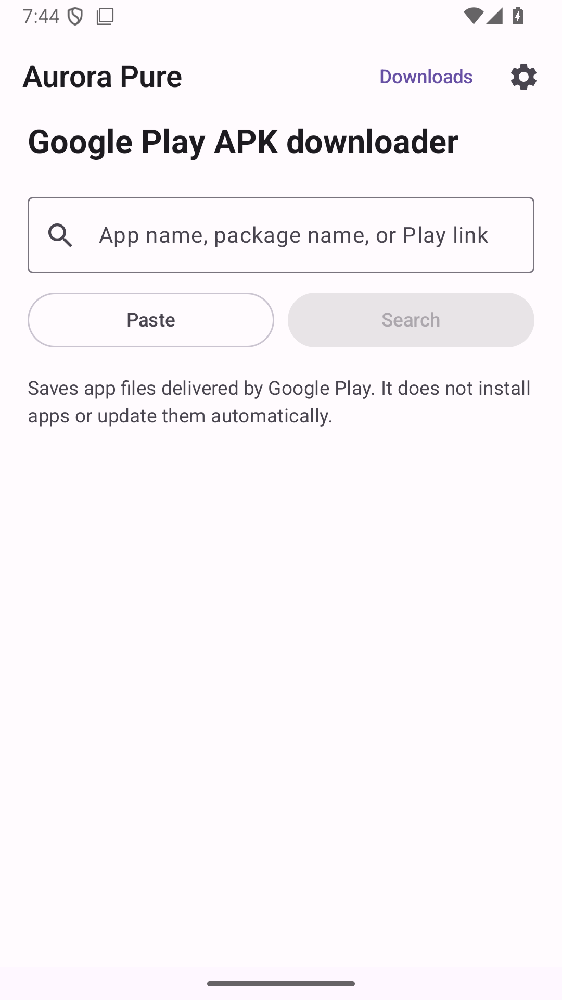
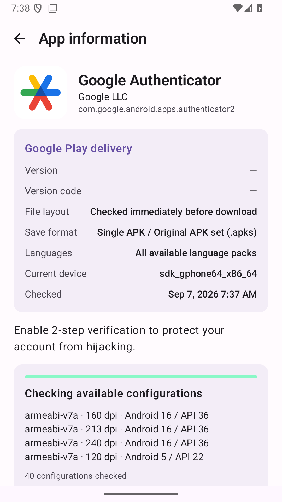
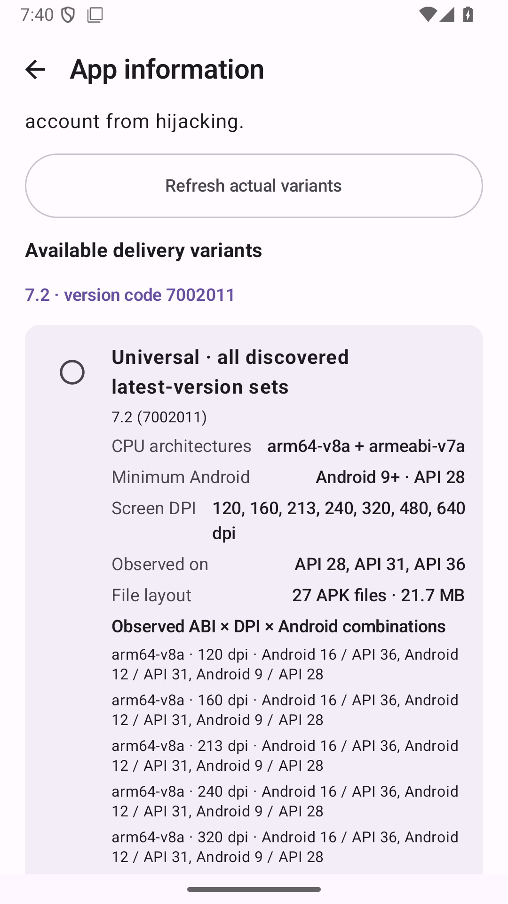
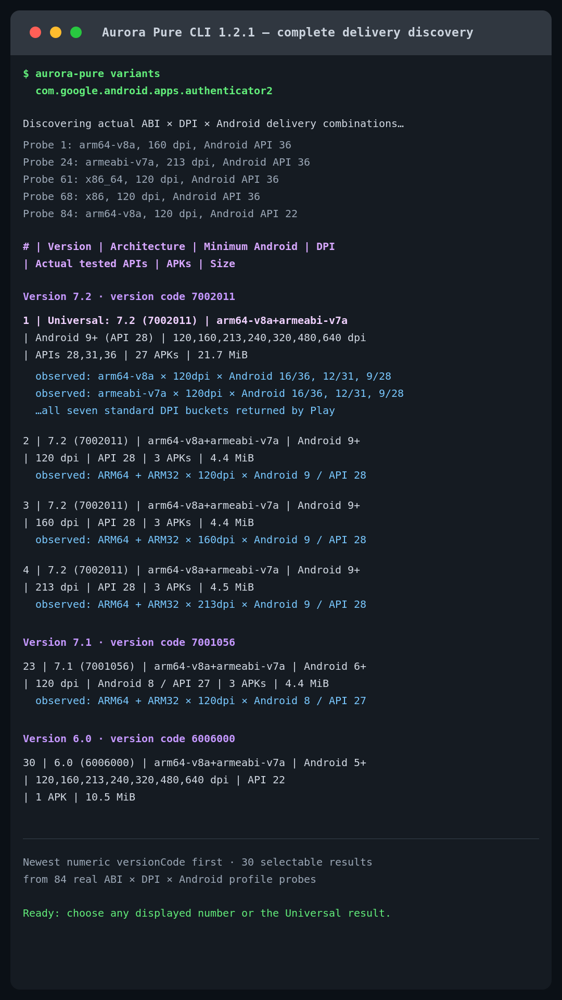

# Aurora Pure

[](https://github.com/sampple-korea/AuroraPure/actions/workflows/android.yml)
[](https://github.com/sampple-korea/AuroraPure/releases/latest)
[](LICENSE)

[English](README.md) · [한국어](README.ko.md) · **简体中文** · [日本語](README.ja.md)

Aurora Pure 是一款仅用于下载的 Android 应用和桌面 CLI，用来保存 Google Play 实际交付的 APK 文件。它保留 Aurora Store 中实用的搜索、图标、开发者和说明界面，同时移除安装、已安装应用管理与自动更新。

> Aurora Pure 是独立的 GPL 分支，并非 Google 或 Aurora OSS 的官方发行版，与二者均无隶属关系。

## 当前界面

<p align="center">
  
  
  
  
</p>

以上 Android 截图和 CLI 图来自 1.2.1 候选版本。Android 应用与 CLI 完整支持英语、简体中文、日语和韩语。

## 下载

请从 [GitHub Releases](https://github.com/sampple-korea/AuroraPure/releases/latest) 获取发行文件。

| 平台 | 文件 | 要求 |
| --- | --- | --- |
| Android | `AuroraPure-1.2.1.apk` | Android 10 / API 29 或更高 |
| Linux、macOS CLI | `aurora-pure-cli-1.2.1.tar` 或 `.zip` | Java 21 或更高 |
| Windows CLI | `aurora-pure-cli-1.2.1.zip` | Java 21 或更高；运行 `bin\aurora-pure.bat` |

Aurora Pure 只负责下载。若要安装结果，请另行使用 Android 文件管理器或兼容的分包 APK 安装器。

## 1.2.1 功能

- 按应用名、包名、Google Play URL 或分享的 Play 链接搜索。
- 显示图标、开发者、包名、版本信息和说明。
- 无需输入个人 Google 账号的匿名会话。
- 打开应用详情时无需预选 ABI 或 DPI，自动查询支持的**全部真实交付组合**。
- 按数字版本代码从新到旧分组结果，再从列表选择 Google Play 实际返回的 ABI、最低 Android、实测 Android 配置和屏幕 DPI。
- 探测 ARM64、ARM32、x86_64 和 x86，并提供汇总 Play 实际返回最新集合的 **Universal 结果**。
- 探测标准密度 120、160、213、240、320、480、640dpi，以及每条路径中真实存在的 Android 交付层级。
- 最多并行查询四条独立交付路径，并在 Android 加载界面显示正在处理的 ABI、DPI 和 Android 配置。
- 读取 base APK 的 split 声明，默认请求**全部已发布语言 APK**。
- 最多并行下载四个唯一 APK，安全 Range 续传，并避免重复传输相同内容。
- 验证 Play 参考哈希、APK 签名、签名者一致性、包名、版本、split 标识和最终保存文件。
- 单文件保存为 `.apk`，分包结果保存为只含 APK 的 `.apks`。
- 桌面 CLI 完整支持搜索、发现、选择、下载、验证、历史和配置。

## 真实变体发现

在 Android 中打开应用后，Aurora Pure 会自动开始完整扫描：ARM64、ARM32、x86_64、x86 与七种标准 DPI。每条 `ABI × DPI` 路径从 Android API 36 开始，读取 Google Play 实际返回 APK Manifest 的 `minSdk`，再探测下一个有意义的旧 Android 层级。独立路径采用有上限的并行处理，每条路径内部仍保持顺序。

结果按数字 `versionCode` 从大到小分成版本区段，最新版本在前；不会按显示用的 `versionName` 字符串排序。同一版本内，只有版本和实际 APK 文件集完全相同的响应才会合并。每个可选行都会显示：

- 交付版本名和版本代码；
- 兼容 ABI；
- APK Manifest 中的最低 Android；
- 实际观察到的 DPI；
- 返回该文件集的 Android API 配置；
- 唯一 APK 数量和下载大小。

**Universal** 行会在不混合版本代码的前提下汇总最新已发现集合。系统会探测四种 ABI；如果 Play 没有为该应用交付某个架构，就会明确省略而不会伪造，并在行中显示实际返回的架构。扫描结束后不会自动选择任何结果，选择权留给用户。Aurora Pure 不会重写多个 split APK，也不会伪造单体通用 APK。

Google Play 还可能按设备功能或图形纹理格式等维度定向。1.2.1 明确覆盖 ABI、密度、Android 版本和语言维度，而不声称覆盖 Play 的所有可能维度。

## 输出约定

| 实际交付结果 | 保存文件 | 内容 |
| --- | --- | --- |
| 一个独立 APK | `.apk` | Google Play 交付的原始 APK 字节 |
| 多个 APK | `.apks` | 根目录仅含 `.apk`；没有 JSON、校验和文本、图标或修改后的 APK |

文件名使用包名、版本代码和必要的 ABI/DPI 标识。全部已发布语言包本来就是默认行为，因此不会追加 `_all-languages`。

Aurora Pure 的 `.apks` 遵循 SAI 等工具支持的简单 APK-only ZIP 约定。它并不声称是由 `bundletool build-apks` 从 AAB 生成的归档，也不包含 AAB 派生的 `toc.pb`。Universal 和合并归档可能含有不同的 base/config 备选项，安装器必须选择一组兼容文件。

运行后下载的 Play Asset Delivery 内容、账号数据和游戏完整资源不属于 APK-only 范围。如果 Google Play 报告额外的非 APK 数据，Aurora Pure 会显示此限制。

## 桌面 CLI

不带子命令运行会进入带编号搜索和真实变体选择的引导流程：

```bash
bin/aurora-pure
```

所有功能也可用于脚本：

```bash
bin/aurora-pure search "Google Authenticator"
bin/aurora-pure info com.google.android.apps.authenticator2

bin/aurora-pure variants com.google.android.apps.authenticator2

bin/aurora-pure download com.google.android.apps.authenticator2 \
  --variant universal --yes

bin/aurora-pure verify ~/Downloads/AuroraPure/example.apks
bin/aurora-pure history --json
```

CLI 默认也会扫描全部组合。只有在自动化中有意缩小范围时，才需要使用 `--architecture`（`universal`、`both`、`64`、`32`、`arm64`、`arm32`、`x86_64`、`x86`）、`--density`（`current`、`all`、标准名称或精确 DPI）和 `--android-api`。`config` 只存储语言、下载并行数与输出位置；`history` 不保存令牌、Cookie 或签名下载 URL。

## 有意移除的功能

- 直接安装和启动系统安装器；
- root、Shizuku 或无人值守安装；
- 已安装应用清单和更新列表；
- 自动、定时、启动后或后台下载；
- 个人 Google 账号登录和账号管理；
- 推荐、排行、提交评论、分析和广告；
- 任意 URL 或 APK 镜像下载。

Android 应用完全离开前台时会暂停网络传输。返回并选择“继续”后，只有通过 Range 安全检查才会续传。CLI 中断时会保留安全的 `.part` 文件，并且仅在服务器 `Content-Range` 精确匹配时追加。

## 权限、构建与许可证

最终应用只请求 `android.permission.INTERNET` 和 `android.permission.ACCESS_NETWORK_STATE` 两项 Android 平台权限。它不请求安装、查看所有应用、访问所有文件、通知或前台服务权限。AndroidX 还会合并一项以应用 ID 为作用域的 `signature` 权限，用于保护非导出的兼容广播；它不授予任何 Android 平台能力，且只有同签名应用可以持有。项目也没有自有广告、行为分析和自动崩溃上传。详情请阅读 [PRIVACY.md](PRIVACY.md)。

使用 JDK 21 和 Android SDK 36 构建：

```bash
./gradlew --no-daemon --no-configuration-cache \
  :pure:testDebugUnitTest :pure:lintDebug :pure:assembleRelease \
  :cli:test :cli:distZip :cli:distTar
```

更多验证和签名说明见 [BUILDING.md](BUILDING.md)。Aurora Pure 派生自 [Aurora Store 4.8.3](https://gitlab.com/AuroraOSS/AuroraStore/-/tree/4.8.3) 的提交 `e9be2c8293e02cc362d603df6b12b019fdb849f2`，按 GNU GPL v3 或更高版本发布。

“最新”表示 Aurora Pure 在全部可查询匿名交付配置中当前观察到的版本，而不保证是全球最高版本。非官方 Google Play API 与外部匿名凭据服务可能发生变化或暂时不可用。
